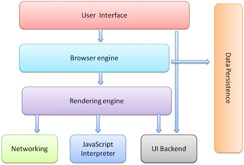
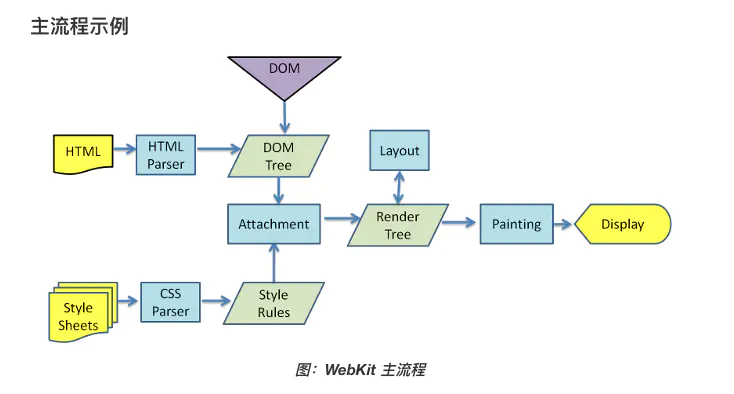

# 浏览器的主要组成部分

1. 用户界面 - 包括地址栏、前进/后退按钮、书签菜单等。除了浏览器主窗口显示的您请求的页面外，其他显示的各个部分都属于用户界面。
2. 浏览器引擎 - 在用户界面和呈现引擎之间传送指令。
3. 呈现引擎 - 负责显示请求的内容。如果请求的内容是 HTML，它就负责解析 HTML 和 CSS 内容，并将解析后的内容显示在屏幕上。
4. 网络 - 用于网络调用，比如 HTTP 请求。其接口与平台无关，并为所有平台提供底层实现。
5. 用户界面后端 - 用于绘制基本的窗口小部件，比如组合框和窗口。其公开了与平台无关的通用接口，而在底层使用操作系统的用户界面方法。
6. JavaScript 解释器。用于解析和执行 JavaScript 代码。
7. 数据存储。这是持久层。浏览器需要在硬盘上保存各种数据，例如 Cookie。新的 HTML 规范 (HTML5) 定义了“网络数据库”，这是一个完整（但是轻便）的浏览器内数据库。

# 浏览器渲染流程
1. 浏览器获取HTML文件，然后对文件进行解析，形成DOM Tree
2. 与此同时，进行CSS解析，生成Style Rules
3. 接着将DOM Tree与Style Rules合成为 Render Tree
4. 接着进入布局（Layout）阶段，也就是为每个节点分配一个应出现在屏幕上的确切坐标
5. 随后调用GPU进行绘制（Paint），遍历Render Tree的节点，并将元素呈现出来

