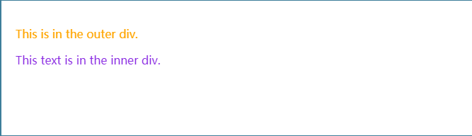
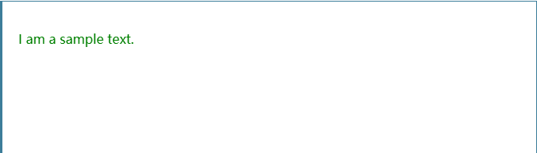
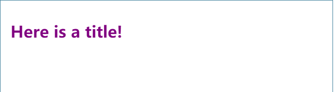
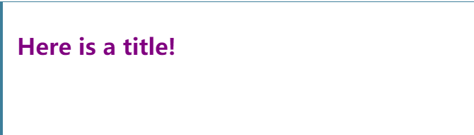

# CSS选择器优先级
[参考MDN](https://developer.mozilla.org/zh-CN/docs/Web/CSS/Specificity)
## 优先级是如何计算的？

优先级就是分配给指定的 CSS 声明的一个权重，它由 匹配的选择器中的 每一种选择器类型的 数值 决定。

而当优先级与多个 CSS 声明中任意一个声明的优先级相等的时候，CSS 中最后的那个声明将会被应用到元素上。

当同一个元素有多个声明的时候，优先级才会有意义。因为每一个直接作用于元素的 CSS 规则总是会接管/覆盖（take over）该元素从祖先元素继承而来的规则。

> 注意: 文档树中元素的接近度（Proximity of elements）对优先级没有影响。

### **选择器类型**

下面列表中，选择器类型的优先级是递增的：

1. 类型选择器（例如，h1）和伪元素（例如，::before）
2. 类选择器 (例如，.example)，属性选择器（例如，[type="radio"]）和伪类（例如，:hover）
3. ID 选择器（例如，#example）。

通配选择符（universal selector）（*）关系选择符（combinators）（+, >, ~, ' ', ||）和 否定伪类（negation pseudo-class）（:not()）对优先级没有影响。（但是，在 :not() 内部声明的选择器会影响优先级）。

给元素添加的内联样式 (例如，style="font-weight:bold") 总会覆盖外部样式表的任何样式 ，因此可看作是具有最高的优先级。

### **!important 例外规则**

当在一个样式声明中使用一个 !important 规则时，此声明将覆盖任何其他声明。虽然，从技术上讲，!important 与优先级无关，但它与最终的结果直接相关。使用 !important 是一个坏习惯，应该尽量避免，因为这破坏了样式表中的固有的级联规则 使得调试找bug变得更加困难了。当两条相互冲突的带有 !important 规则的声明被应用到相同的元素上时，拥有更大优先级的声明将会被采用。

一些经验法则：

- 一定要优化考虑使用样式规则的优先级来解决问题而不是 !important
- 只有在需要覆盖全站或外部 CSS 的特定页面中使用 !important
- 永远不要在你的插件中使用 !important
- 永远不要在全站范围的 CSS 代码中使用 !important

**与其使用 !important，你可以：**

1. 更好地利用 CSS 级联属性
2. 使用更具体的规则。在您选择的元素之前，增加一个或多个其他元素，使选择器变得更加具体，并获得更高的优先级。
    ```html
    <div id="test">
      <span>Text</span>
    </div>
    ```
    ```css
    div#test span { color: green; }
    div span { color: blue; }
    span { color: red; }
    ```
    无论 c​ss 语句的顺序是什么样的，文本都会是绿色的（green），因为这一条规则是最有针对性、优先级最高的。（同理，无论语句顺序怎样，蓝色 blue 的规则都会覆盖红色 red 的规则）

3. 对于（2）的一种特殊情况，当您无其他要指定的内容时，请复制简单的选择器以增加特异性。
    ```css
    #myId#myId span { color: yellow; }
    .myClass.myClass span { color: orange; }
    ```

**什么的情况下可以使用 !important：**

**A) 覆盖内联样式**

你的网站上有一个设定了全站样式的 CSS 文件，同时你（或是你同事）写了一些很差的内联样式。

全局的CSS文件会在全局范围内设置网站的外观，而直接在各个元素上定义的内联样式可能会覆盖您的全局CSS文件。 内联样式和！important都被认为是非常不好的做法，但是有时你可以在CSS文件里用!important去覆盖内联样式。

在这种情况下，你就可以在你全局的 CSS 文件中写一些 !important 的样式来覆盖掉那些直接写在元素上的行内样式。
```html
<div class="foo" style="color: red;">
What color am I?</div>
```

```css
.foo[style*="color: red"] { 
  color: firebrick !important;
}
```

**B) 覆盖优先级高的选择器**
```css
#someElement p {
  color: blue;
}

p.awesome {
  color: red;
}
```
在外层有 #someElement 的情况下，你怎样能使 awesome 的段落变成红色呢？这种情况下，如果不使用 !important ，第一条规则永远比第二条的优先级更高

### **怎样覆盖 !important**

A)很简单，只需再添加一条 带 !important 的CSS规则，再给这个给选择器更高的优先级（添加一个标签，ID或类）；或是添加一样选择器，把它的位置放在原有声明的后面（总之，最后定义一条规则比胜）。

一些拥有更高优先级的例子：
```css
   table td { height: 50px !important; }
.myTable td { height: 50px !important; }
#myTable td { height: 50px !important; }
```

B)或者使用相同的选择器，但是置于已有的样式之后：
```css
td { height: 50px !important; }
```

C)或干脆改写原来的规则，以避免使用 !important。
```css
[id="someElement"] p {
  color: blue;
}

p.awesome {
  color: red;
}
```

将id作为属性选择器的一部分而不是id选择器，将使其具有与类相同的特异性。 上面的两个选择器现在具有相同的权重。 在优先级相同情况下，后面定义的CSS样式会被应用。

### **:is() 和 :not()的例外情况**
:is 匹配伪类和:not 否定伪类在优先级计算中不会被看作是伪类。事实上，在计算选择器数量时还是会把其中的选择器当做普通选择器进行计数。

这是一块 CSS 代码：
```css
div.outer p {
  color: orange;
}

div:not(.outer) p {
  color: blueviolet;
}
```
当它被应用在下面的 HTML 上时：
```html
<div class="outer">
  <p>This is in the outer div.</p>
  <div class="inner">
    <p>This text is in the inner div.</p>
  </div>
</div>
```

…会在屏幕上出现以下结果：


### **基于形式的优先级（Form-based specificity）**

优先级是基于选择器的形式进行计算的。在下面的例子中，尽管选择器*[id="foo"] 选择了一个ID，但是它还是作为一个属性选择器来计算自身的优先级。

有如下样式声明：
```css
*#foo {
  color: green;
}

*[id="foo"] {
  color: purple;
}
```
将其应用在下面的HTML中：
```html
<p id="foo">I am a sample text.</p>
```
最终会出现下面的效果：


虽然匹配了相同的元素，但是 ID 选择器拥有更高的优先级。所以第一条样式声明生效。

### **无视DOM树中的距离**

有如下样式声明：

```css
body h1 {
  color: green;
}

html h1 {
  color: purple;
}
```
当它应用在下面的 HTML 时：
```html
<html>
  <body>
    <h1>Here is a title!</h1>
  </body>
</html>
```
浏览器会将它渲染成：


### **直接给目标元素添加样式和目标元素继承样式对比**

为目标元素直接添加样式，永远比继承样式的优先级高，无视优先级的遗传规则。

```css
#parent {
  color: green;
}

h1 {
  color: purple;
}
```
当它应用在下面的HTML时：
```html
<html>
  <body id="parent">
    <h1>Here is a title!</h1>
  </body>
</html>
```
浏览器会将它渲染成：


**因为 h1 选择器明确的定位到了元素，但绿色选择器的仅仅继承自其父级。**

