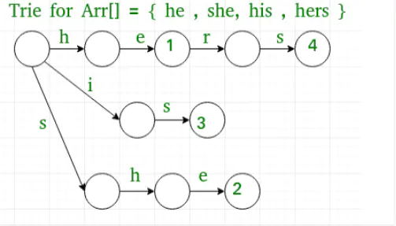
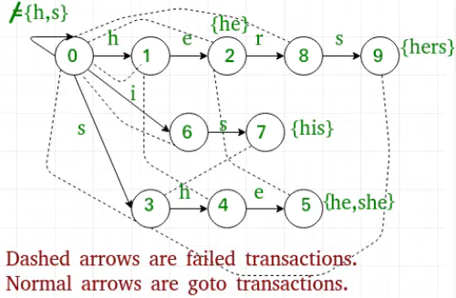

# 「字符串匹配算法」

## 前言
一说到两个字符串匹配，我们很自然就会想到用两层循环来匹配，用这种方式就可以实现一个字符串是否包含另一个字符串了，这种算法我们称为 BF算法。

## BF算法

BF算法，即暴力(Brute Force)算法，是普通的模式匹配算法，BF算法的思想就是将目标串 S 的第一个字符与模式串 T 的第一个字符进行匹配，若相等，则继续比较 S 的第二个字符和 T的第二个字符；若不相等，则比较 S 的第二个字符和 T 的第一个字符，依次比较下去，直到得出最后的匹配结果。

## BF算法实现

```java
public static int bruteforce(String s,String t){
    int length = s.length();//目标字符串的长度
    int plength = t.length();//模式串的长度

    //循环目标字符串
    for(int i=0;i<length-plength;i++){
        //循环模式串
        int j=0;
        while((j < plength) && (s.charAt(i+j) == t.charAt(j))){
            j++;
        }
        if(j == plength){
            return i;
        }
    }

    return -1;
}
```

BF算法是一种蛮力算法，没有任何优化，就是用两层循环的比较，当字符串比较大的时候，执行效率就非常低下，不适合比较非常大的字符串。

该算法最坏情况下要进行 M*(N-M) 次比较，时间复杂度为 O(M*N)。因此，如果我们使用暴力搜索一串'm'字符中的'n'个字符串，那么我们需要尝试 n*m 次。

虽然暴力搜索很容易实现，并且如果解决方案存在它就一定能够找到，但是它的代价是和候选方案的数量成比例的，由于这一点，在很多实际问题中，消耗的代价会随着问题规模的增加而快速地增长。因此，当问题规模有限，或当存在可用于将候选解决方案的集合减少到可管理大小的针对特定问题的启发式算法时，通常使用暴力搜索。另外，当实现方法的简单度比运算效率更重要的时候，也会用到这种方法。

我们看到暴力搜索算法虽然不需要预处理字符串，但效率比较低下，因为它需要做很多不必要的匹配，因此我们需要更高效的算法。

## AC自动机算法
Aho–Corasick算法是由 Alfred V. Aho 和 Margaret J.Corasick 发明的字符串搜索算法，用于在输入的一串字符串中匹配预先构建好的 Trie 树中的子串。它与普通字符串匹配的不同点在于同时与所有字典串进行匹配。算法均摊情况下具有近似于线性的时间复杂度，约为字符串的长度加所有匹配的数量。

假设 m 为模式的长度， n 为要搜索的字符串长度， k为字母表长度。该算法由于需要预先构建好变异的 Trie 树，因此需要 O(mk) 的预处理时间。但在正真搜索字符串时的时间复杂度为 O(n)，大大的提高了字符串搜索时间。

该算法主要依靠构造一个有限状态机（类似于在一个 Trie 树中添加失配指针）来实现。这些额外的失配指针允许在查找字符串失败时进行回退（例如设 Trie 树的单词 cat 匹配失败，但是在 Trie 树中存在另一个单词 cart，失配指针就会指向前缀 ca ），转向某前缀的其他分支，免于重复匹配前缀，提高算法效率。

当一个字典串集合是已知的(例如一个计算机病毒库), 就可以以离线方式先将自动机求出并储存以供日后使用，在这种情况下，算法的时间复杂度为输入字符串长度和匹配数量之和，也是 AC自动机算法常用的情况。

### 构造

1. 一棵根据单词或者内容构建 Trie 树。这个也叫 goto表。


2. 在一个单词结束的地方，会有指向一个 Trie树根或者其他分支上和它相同的字符，这个就是回退指针，免于重复匹配前缀，提高算法效率。比如下图中的单词 his 结尾的 s 指向 she 的 s，就可以在原有的基础上继续向下查找，减少前缀的匹配次数。这个也叫 fail表。



### 查找

先查找当前节点的“孩子节点”，如果没有找到匹配，查找它的后缀节点的孩子，如果仍然没有，接着查找后缀节点的对应 fail表的后缀节点的孩子, 如此循环, 直到根节点，如果到达根节点仍没有找到匹配则结束。

当算法查找到一个节点，则输出所有结束在当前位置的字典项。输出步骤为首先找到该节点的字典后缀，然后用递归的方式一直执行到节点没有字典前缀为止。同时，如果该节点为一个字典节点，则输出该节点本身。

### 实现

在 GitHub 上有个开源的实现，有兴趣的同学可以细读。[github.com/robert-bor/…](https://github.com/robert-bor/aho-corasick)

有没有不需要提前做那么多处理，后期匹配又快的算法呢？
答案就是 KMP算法。

## KMP算法
它以三个发明者命名，起头的那个 K 就是著名科学家 Donald Knuth。

KMP算法示例 这个算法的关键在于 部分匹配表（partial match table，也叫 PMT表），那这个部分匹配表怎么来的呢？我们看下模式串 “abababca” 的部分匹配表：
```
char:  | a | b | a | b | a | b | c | a |
index: | 0 | 1 | 2 | 3 | 4 | 5 | 6 | 7 | 
value: | 0 | 0 | 1 | 2 | 3 | 4 | 0 | 1 |
```

对应的 value，就是模式串 “abababca” 的部分匹配表。

要理解部分匹配表，我们需要先知道前缀和后缀。
"前缀"指除了最后一个字符以外，一个字符串的全部头部组合；
"后缀"指除了第一个字符以外，一个字符串的全部尾部组合。

```
字符串：Knuth
前缀：  K, Kn, Knu, Knut
后缀：  nuth, uth, th, h
```
现在我们根据"前缀"和"后缀"来求出模式串 “abababca” 的部分匹配表。

1. "a" 的前缀和后缀都为空集，没有共有元素，长度为 0；
2. "ab" 的前缀为[a]，后缀为[b]，没有共有元素，长度为 0；
3. "aba" 的前缀为[a, ab]，后缀为[ba, a]，共有元素 "a", 长度为 1；
4. "abab" 的前缀为[a, ab, aba]，后缀为[bab, ab, b]，共有元素 "ab", 长度为 2；
...
7. "abababc" 的前缀为[a, ab, aba, abab, ababa, ababab]，后缀为[bababc, ababc, babc, bc, c]，没有共有元素, 长度为 0；
8. "abababca" 的前缀为[a, ab, aba, abab, ababa, ababab, abababc]，后缀为[bababca, ababca, babca, bca, ca, a]，共有元素 "a", 长度为 1；

### **怎么根据部分匹配表查找呢？**

当我们找到部分匹配时，我们可以使用部分匹配表中的值来跳过（而不是重做不必要的旧比较）。
```
移动位数 = 已匹配的字符数 - 对应部分匹配表值
```
我们将 “abababca” 模式串与 “bacbababaabcbab” 字符串的匹配举例。
```
bacbababaabcbab
 |
 abababca
```
第一步，由于我们的模式串开头是 "a", 然后循环字符串，第二个字符就是 "a"，这说明有一个字符匹配。由于下一个字符不匹配，因此我们需要移动。移动的位数等于 部分匹配表[ 已匹配的字符数 - 1 ]，也就是部分匹配表中下表为 0 的值，为 0。因此我们需要向后跳过 0 个字符，继续循环。
```
bacbababaabcbab
    |||||
    abababca
```
现在匹配了 5 个字符，需要跳过的字符数就是 5 - 3 = 2，需要向后移动 2 位。
```
// x 表示跳过的字符

bacbababaabcbab
    xx|||
      abababca
```
现在匹配了 3 个字符，需要跳过的字符数就是 3 - 1 = 2，需要向后移动 2 位。
```
bacbababaabcbab
      xx|
        abababca
```
此时，我们的模式比文本中的其余字符长，所以我们知道并没有匹配。

## 总结
BF算法 属于暴力破解的方式，利用穷举来实现字符串的查找，当字符串太长的时候，查找速度是非常慢的。

于是又有了 AC自动机算法，它是先构建一个类似 Trie树 的结构，在根据 Trie树 查找对应的字符串查，它的时间复杂度差不多是线性的，但需要提前构建好 Trie树。

有没有一种算法既不是穷举的方式，也不需要提前构建好 Trie树。

那就是大名鼎鼎的 KMP算法，它通过运用对这个词在不匹配时本身就包含足够的信息来确定下一个匹配将在哪里开始的，从而避免重新检查先前匹配的字符，也就是我们上面的部分匹配表（PMT表）。