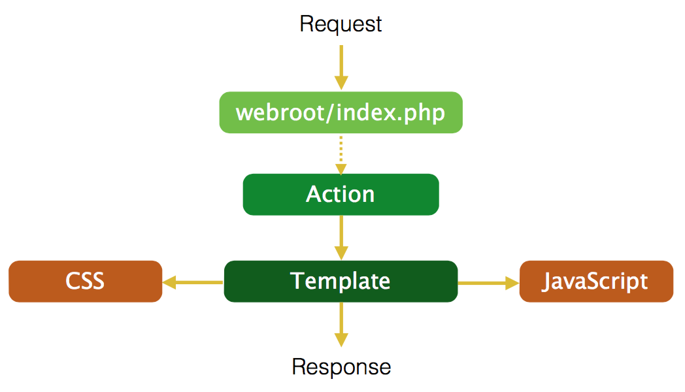
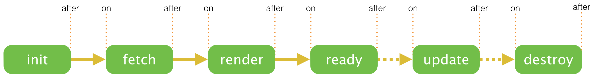

# 前端组件化开发实践（美团）

## 组件化 1.0：资源重组

在美团早期，前端资源是按照页面或者类似业务页面集合的形式进行组织的。例如 order.js 对应订单相关页面的交互，account.css 对应账户相关页面的样式。这种方式在过去的较长一段时间内，持续支撑了整个项目的正常推进，功勋卓著。



随着业务规模的增加和开发团队的扩张，这套机制逐渐显示出它的一些不足：

- 资源冗余

页面的逐渐增加，交互的逐渐复杂化，导致对应的 css 和 js 都有大幅度增长，进而出现为了依赖某个 js 中的一个函数，需要加载整个模块，或者为了使用某个 css 中的部分样式依赖整个 css，冗余资源较多

- 对应关系不直观

没有显而易见的对应规则，导致的一个问题是修改某个业务模块的 css 或者 js 时，几乎只能依靠 grep。靠人来维护页面模块 html、css 和 js 之间的依赖关系，容易犯错，常常出现内容已经删除但是 css 或 js 还存在的问题

- 难于单元测试

以页面为最小粒度进行资源整合，不同功能的业务模块相互影响，复杂度太高，自动化测试难以推进

2013 年开始，在调研了 FIS、BEM 等方案之后，结合美团开发框架的实际，我们初步实现了一套轻量级的组件化开发方案。主要的改进是：

- 以页面功能组件为单位聚合前端资源
- 自动加载符合约定的 css、js 资源
- 将业务数据到渲染数据的转换过程独立出来


举例来说，美团顶部的搜索框就被实现为一个组件。


代码构成：
```
www/component/smart-box/
├── smart-box.js    # 交互
├── smart-box.php   # 渲染数据生产、组件配置
├── smart-box.scss  # 样式
├── smart-box.tpl   # 内容
└── test
    ├── default.js  # 自动化测试
    └── default.php # 单测页面
```

调用组件变得十足简单：

```php
echo View::useComponent('smart-box', [
    'keyword' => $keyword
]);
```

对比之前，可以看到组件化的一些特点：

- 按需加载

只加载必要的前端资源

- 对应关系非常清晰

组件所需要的前端资源都在同一目录，职责明确且唯一，对应关系显著

- 易于测试

组件是具备独立展现和交互的最小单元，可利用 Phantom 等工具自动化测试

此外，由于前端资源集中进行调度，组件化也为高阶性能优化提供了空间。例如实现组件级别的 BigRender、通过数据分析进行资源的合并加载等等。

## 组件化 2.0：趋于成熟

组件化 1.0 上线后，由于简单易用，很快得到工程师的认可，并开始在各项业务中应用起来。新的需求接踵而来，一直持续到 2014 年底，这个阶段我们称之为组件化 2.0。下面介绍下主要的几个改进。

### Lifecycle

组件在高内聚的同时，往往需要暴露一些接口供外界调用，从而能够适应复杂的页面需求，例如提交订单页面需要在支付密码组件启动完成后绑定提交时的检查。Web Components、React 等都选择了生命周期事件/方法，我们也是一样。

组件的生命周期：



一个组件的完整生命周期包括：
- init，初始化组件根节点和配置
- fetch，加载 css 和 js 资源
- render，内容渲染，默认的渲染内容方式是 BigRender
- ready，进行数据绑定等操作
- update，数据更新
- destroy，解除所有事件监听，删除所有组件节点

组件提供 pause、resume 方法以方便进行生命周期控制。各个阶段使用 Promise 串行进行，异步的管理更清晰。使用自定义语义事件，在修改默认行为、组件间通信上充分利用了 YUI 强大的自定义事件体系，有效降低了开发维护成本。

举个例子，页面初始化时组件的启动过程实际也是借助生命周期实现的：

```javascript
var afterLoadList = [];
Y.all('[data-component]').each(function (node) {
    var component = new Y.mt.Component(node);
    // 绑定 init 生命周期事件，在 init 默认行为完成后执行回调
    component.after('init', function (e) {
        // 如果配置了延迟启动
        if (e.config.afterLoad) {
            // 暂停组件生命周期
            e.component.pause();
            // 压入延迟启动数组
            afterLoadList.push(e.component);
        }
    });
    // 开始进入生命周期
    component.start();
});
 
Y.on('load', function () {
    // 在页面 load 事件发生时恢复组件生命周期
    afterLoadList.forEach(function (component) {
        component.resume();
    });
});
```

回过头来看，引入生命周期除了带来扩展性外，更重要的是理顺了组件的各个阶段，有助于更好的理解和运用。

### Data Binding

数据绑定是我们期盼已久的功能，将 View 和 ViewModel 之间的交互自动化无疑会节省工程师的大量时间。在组件化减少关注点和降低复杂度后，实现数据绑定变得更加可能。

我们最终实现的数据绑定方案主要参考了 Angular，通过在 html 节点上添加特定的属性声明绑定逻辑，js 扫描这些内容并进行相应的渲染和事件绑定。当数据发生变化时，对应的内容全部重新渲染。

```html
<ul class="addressList">
    <li
        mt-bind-repeat="addr in addrList"
        mt-bind-html="addr.text"
    >
    </li>
</ul>

<script>
Y.use(['mt-bind', 'mt-scope'], function () {
    Y.mt.bind.init(document.body);
    var scope = Y.one('.addressList').getScope();
    // 将 scope.addrList 设置为一个数组，DOM 上将自动渲染其内容   
    scope.$set('addrList', [
        { text: "first address" },
        { text: "second address" }
    ]);
});
</script>
```

使用属性声明绑定逻辑的好处是可以同时支持后端渲染，这对于美团团购这样的偏展现型业务是非常必要的，用户可以很快看到页面内容。

### Flux

实现数据绑定后，我们不得不面对另外一个问题：如何协同多个组件间的数据。因为某个组件的数据变化，很有可能引起其他组件的变化。例如当修改购买数量，总金额会变化，而总金额超过 500 后，还需要展示大额消费提醒。

为了解决这个问题，我们引入了 Flux，使用全局消息总线的思路进行跨组件交互。

例如因为交互复杂而一直让我们非常头疼的项目购买页，在应用组件 + Flux 重构后，各模块之间的互动更加清晰：


其他方面的改进还有很多，包括引入模板引擎 LightnCandy 约束模板逻辑、支持组件任意嵌套、支持异步加载并自动初始化等。

随着组件化 2.0 的逐步完善，基本已经可以从容应对日常开发，在效率和质量方面都上了一个台阶。

## 组件化 3.0：重启征程

时间的车轮滚滚前行，2014 年底，我们遇到一些新的机遇和挑战：

- 基于 Node 的全栈开发模式开始应用，前后端渲染有了更多的可能性
- YUI 停止维护，需要一套新的资源管理方案
- 新业务不断增加，需要找到一种组件共享的方式，避免重复造轮子

结合之前的实践，以及在这一过程中逐渐积累的对业内方案的认知，我们提出了新的组件化方案：

- 基于 React 开发页面组件，使用 NPM 进行分发，方便共建共享
- 基于 Browserify 二次开发，建设资源打包工具 Reduce，方便浏览器加载
- 建设适应组件化开发模式的工程化开发方案 Turbo，方便工程师将组件应用于业务开发中

### React

在组件化 2.0 的过程中，我们发现很多功能和 React 重合，例如 Data Binding、Lifecycle、前后端渲染，甚至直接借鉴的 Flux。除此之外，React 的函数式编程思想、增量更新、兼容性良好的事件体系也让我们非常向往。借着前端全栈开发的契机，我们开始考虑基于 React 进行组件化 3.0 的建设。

### NPM + Reduce

NPM + Reduce 构成了我们新的资源管理方案，其中：

- NPM 负责组件的发布和安装。可以认为是“分”的过程，粒度越小，重用的可能性越大
- Reduce 负责将页面资源进行打包。可以认为是“合”的过程，让浏览器更快地加载

一个典型的组件包：

```
smart-box/
├── package.json    # 组件包元信息
├── smart-box.jsx   # React Component
├── smart-box.scss  # 样式
└── test
    └── main.js     # 测试
```

NPM 默认只支持 js 文件的管理，我们对 NPM 中的 package.json 进行了扩展，增加了 style 字段，以使打包工具 Reduce 也能够对 css 和 css 中引用的 image、font 进行识别和处理：

```json
{
    "style": "./smart-box.scss"
}
```

只要在页面中 require 了 smart-box，经过 Reduce 打包后，js、css 甚至图片、字体，都会出现在浏览器中。

```javascript
var SmartBox = require('@mtfe/smart-box');
// 页面
var IndexPage = React.createClass({
    render: function () {
        return (
            <Header>
                <SmartBox keyword={ this.props.keyword } />
            </Header>
            ...
        );
    }
});
module.exports = IndexPage;
```

整体思路和组件化 1.0 如出一辙，却又那么不同。

### Turbo
单单解决分发和打包的问题还不够，业务开发过程如果变得繁琐、难以 Debug、性能低下的话，恐怕不会受到工程师欢迎。

为了解决这些问题，我们在 Node 框架的基础上，提供了一系列中间件和开发工具，逐步构建对组件友好的前端工程化方案 Turbo。主要有：

- 支持前后端同构渲染，让用户更早看到内容
- 简化 Flux 流程，数据流更加清晰易维护
- 引入 ImmutableJS，保证 Store 以外的数据不可变
- 采用 cursor 机制，保证数据修改/获取同步
- 支持 Hot Module Replacement，改进开发流自动化

通过这些改进，一线工程师可以方便的使用各种组件，专注在业务本身上。开发框架层面的支持也反过来促进了组件化的发展，大家更乐于使用一系列组件来构建页面功能。

## 小结
发现痛点、分析调研、应用改进的解决问题思路在组件化开发实践中不断运用。历经三个大版本的演进，组件化开发模式有效缓解了业务发展带来的复杂度提升的压力，并培养工程师具备小而美的工程思想，形成共建共享的良好氛围。毫无疑问，组件化这种“分而治之”的思想将会长久地影响和促进前端开发模式。我们现在已经准备好，迎接新的机遇和挑战，用技术的不断革新提升工程师的幸福感。

